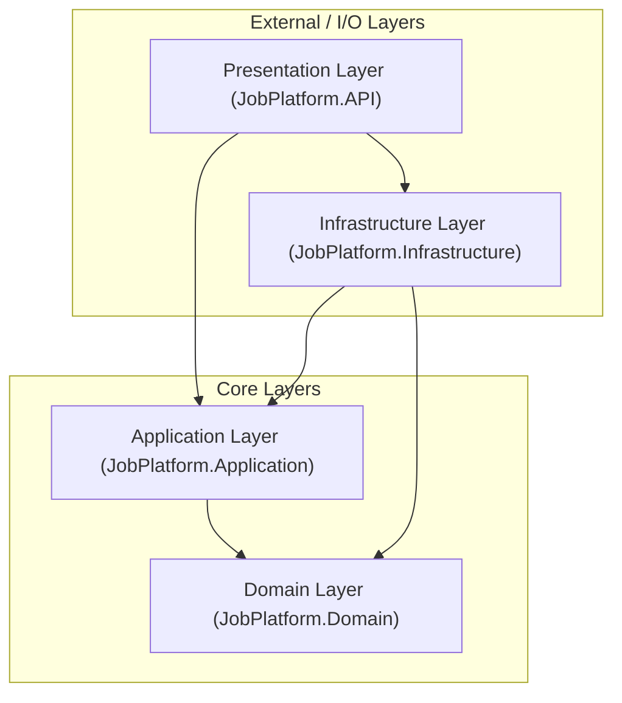
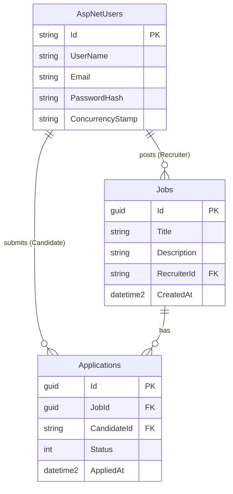

# JobPlatform — CQRS (MediatR) Migration Notes

This repository contains the JobPlatform solution. A minimal, low-risk CQRS migration using MediatR was applied to the Application layer to migrate key Jobs and Applications use-cases to Commands/Queries and Handlers.

## Summary of changes
- Added MediatR and registered handlers by assembly scanning.
- Introduced Commands/Queries/Handlers for Jobs and Applications.
- Controllers `JobsController` and `JobApplicationsController` now use `IMediator` instead of calling services directly.
- Existing business rules remain in the Application services (`JobService`, `ApplicationService`) — handlers call these services to preserve behavior.

## New/Modified files (high level)
- `src/JobPlatform.Application/AssemblyReference.cs` (marker for MediatR scanning)
- `src/JobPlatform.Application/Features/...` (new Commands, Queries and Handlers)
  - Jobs: `CreateJob`, `DeleteJob`, `GetJobs`, `GetJobById`
  - Applications: `ApplyForJob`, `CancelApplication`, `GetMyApplications`, `GetApplicationsForJob`
- `src/JobPlatform.Application/DependencyInjection.cs` — MediatR registration added
- `src/JobPlatform.Application/JobPlatform.Application.csproj` — MediatR packages added
- `src/JobPlatform.API/JobPlatform.API.csproj` — MediatR package added
- `src/JobPlatform.API/Controllers/JobsController.cs` — now uses `IMediator`
- `src/JobPlatform.API/Controllers/JobApplicationsController.cs` — now uses `IMediator`

## Why this approach
- Minimize risk: handlers are thin orchestrators that call existing services, preserving current validation and authorization logic.
- Incremental: start with core write/read flows (Create/Delete job, Apply/Cancel application, and relevant queries).
- Keep Clean Architecture: handlers live in `Application/Features/...`, DI registration in `Application/DependencyInjection`.

## How to build locally
1. From the solution/workspace root run:
   - `dotnet restore`
   - `dotnet build src/JobPlatform.API/JobPlatform.API.csproj`
2. The API runs as before (JWT auth, Identity, database migrations unchanged).

## Notes & next steps
- No FluentValidation or pipeline behaviors were added yet to avoid over-engineering.
- Auth endpoints (`AuthController`) were left using `IAuthService`; they can be migrated to CQRS later.
- Recommended: add unit tests for Handlers (mock `IJobService` / `IApplicationService`) and API integration tests.
- If you want pipeline behaviors (validation/logging) or to move business rules from services into handlers/domain services, we can plan that as a follow-up.

If you want, I can now:
- run `dotnet restore` and `dotnet build` and fix any compile issues, or
- add unit tests for one handler as an example.

# Job Application API

A robust, production-ready RESTful Web API for a Job Application Platform built with ASP.NET Core 8 and Entity Framework Core following Clean Architecture principles. The platform connects recruiters and candidates, providing secure role-based access to publish job openings, submit applications, manage application statuses, and track recruitment workflows.

---

## Features

- **Authentication & Identity Management**:
  - Secure user registration and login powered by ASP.NET Core Identity.
  - Stateless JSON Web Token (JWT Bearer) generation with custom claims (`userId`, `email`, `role`).
  - Passwords securely hashed and verified through ASP.NET Core Identity's cryptographic password hasher.

- **Role-Based Access Control (RBAC)**:
  - Strongly typed role definitions: `Recruiter` and `Candidate`.
  - Endpoint protection enforcing declarative role authorization (`[Authorize(Roles = ...)]`).
  - Automated seeding of default identity roles during application startup.

- **Recruiter Job Management**:
  - Create new job postings with detailed titles and descriptions.
  - Automatic attribution of job ownership to the authenticated recruiter.
  - Delete job postings with application-layer ownership validation (recruiters can only delete their own postings).
  - Inspect all applications submitted to a specific job opening (accessible exclusively by the job's creator).

- **Candidate Job Applications**:
  - Submit applications to active job postings.
  - Prevention of duplicate active applications via business checks and a database-level unique constraint (`CandidateId` + `JobId`).
  - Application re-activation lifecycle: re-applying to a previously cancelled application restores its status to `Applied` and refreshes the application timestamp.
  - Cancel existing applications with candidate ownership enforcement.
  - View personal application history with current application statuses (`Applied`, `Cancelled`).

- **Public Job Discovery**:
  - Publicly accessible endpoints allowing anonymous users to browse all available jobs (ordered chronologically) or retrieve a single job by its ID.

- **Centralized Exception & Error Handling**:
  - Global custom middleware (`ExceptionHandlingMiddleware`) translating domain exceptions (`NotFoundException`, `ForbiddenException`, `ConflictException`, `BadRequestException`) into RFC 7807 standard `ProblemDetails` responses with corresponding HTTP status codes (404, 403, 409, 400, 500).

- **API Documentation & Exploration**:
  - OpenAPI specification and interactive Swagger UI exposed directly at the application root (`/`).
  - Integrated JWT Bearer authorization support within Swagger UI.

- **Automated Database Lifecycle**:
  - Code-First Entity Framework Core migrations.
  - Built-in `DbInitializer` that automatically executes pending EF Core migrations and seeds roles when the service boots.

---

## Architecture

The solution follows the **Clean Architecture** (Onion / Hexagonal Architecture) pattern. Dependencies flow strictly inward toward the core domain, ensuring decoupling from frameworks, UI concerns, and database technologies.



### Layer Responsibilities

1. **`JobPlatform.Domain` (Domain Layer)**:
   - Contains enterprise business concepts, core entities, enums, and domain-specific exceptions.
   - Has zero dependencies on external application packages, databases, or frameworks.
   - **Entities**: `ApplicationUser` (inherits `IdentityUser`), `Job`, `JobApplication`.
   - **Enums**: `ApplicationStatus` (`Applied`, `Cancelled`), `Roles` (`Recruiter`, `Candidate`).
   - **Exceptions**: `DomainException`, `NotFoundException`, `ForbiddenException`, `ConflictException`, `BadRequestException`.

2. **`JobPlatform.Application` (Application Layer)**:
   - Encapsulates application business rules, workflows, and use case orchestration.
   - Defines interfaces for external dependencies (inversion of control) and Data Transfer Objects (DTOs).
   - Depends only on the `Domain` layer.
   - **Interfaces**: `IAuthService`, `IJobService`, `IApplicationService`, `IApplicationDbContext`, `ICurrentUserService`, `IIdentityService`, `IJwtTokenGenerator`.
   - **Services**: `AuthService`, `JobService`, `ApplicationService`.
   - **DTOs**: Auth (`RegisterRequestDto`, `LoginRequestDto`, `AuthResponseDto`), Jobs (`CreateJobRequestDto`, `JobResponseDto`), Applications (`JobApplicationResponseDto`).

3. **`JobPlatform.Infrastructure` (Infrastructure Layer)**:
   - Implements abstractions defined in the `Application` layer for database access, identity, and security token generation.
   - Depends on `Application` and `Domain`.
   - **Persistence**: `ApplicationDbContext` (inherits `IdentityDbContext<ApplicationUser>`), configuring entity relationships, constraints, and table mappings via Fluent API.
   - **Authentication**: `JwtTokenGenerator` using `System.IdentityModel.Tokens.Jwt` and `JwtSettings`.
   - **Identity**: `IdentityService` implementing user management and role assignment with ASP.NET Core Identity.
   - **Initialization**: `DbInitializer` handling schema migrations and role seeding.
   - **Migrations**: EF Core migration snapshots and migration classes.

4. **`JobPlatform.API` (Presentation Layer)**:
   - The web entry point exposing RESTful HTTP endpoints.
   - Manages HTTP concerns, request routing, validation responses, dependency injection composition, and middleware pipelines.
   - **Controllers**: `AuthController`, `JobsController`, `JobApplicationsController`.
   - **Middleware**: `ExceptionHandlingMiddleware`.
   - **Services**: `CurrentUserService` accessing ambient HTTP context claims via `IHttpContextAccessor`.
   - **Configuration & Setup**: `Program.cs` configuring JWT Bearer authentication, Swagger OpenAPI with bearer authorization, and route routing.

---

## Technologies

- **Language & Runtime**: C# 12 / .NET 8.0 SDK (`net8.0`)
- **Web Framework**: ASP.NET Core Web API
- **Object-Relational Mapping (ORM)**: Entity Framework Core 8.0.11 (`Microsoft.EntityFrameworkCore`, `Microsoft.EntityFrameworkCore.SqlServer`, `Microsoft.EntityFrameworkCore.Design`, `Microsoft.EntityFrameworkCore.Tools`)
- **Identity & Membership**: ASP.NET Core Identity (`Microsoft.AspNetCore.Identity.EntityFrameworkCore`, `Microsoft.Extensions.Identity.Stores`)
- **Authentication**: JWT Bearer Tokens (`Microsoft.AspNetCore.Authentication.JwtBearer`, `System.IdentityModel.Tokens.Jwt`, `Microsoft.IdentityModel.Tokens`)
- **Database Engine**: Microsoft SQL Server / LocalDB
- **API Documentation**: Swashbuckle Swagger / OpenAPI 6.6.2 (`Swashbuckle.AspNetCore`)

---

## Project Structure

```text
src/
├── JobPlatform.Domain/                      # Enterprise core entities & domain exceptions
│   ├── Entities/
│   │   ├── ApplicationUser.cs               # Identity user entity with navigation collections
│   │   ├── Job.cs                           # Job posting entity
│   │   └── JobApplication.cs                # Job application join entity
│   ├── Enums/
│   │   ├── ApplicationStatus.cs             # Applied (1), Cancelled (2)
│   │   └── Roles.cs                         # Recruiter, Candidate constants & validation
│   ├── Exceptions/
│   │   └── DomainExceptions.cs              # Domain-level exception definitions
│   └── JobPlatform.Domain.csproj
│
├── JobPlatform.Application/                 # Use cases, interfaces, DTOs & service implementations
│   ├── Common/
│   │   └── Interfaces/
│   │       ├── IApplicationDbContext.cs     # DbContext abstraction (Jobs, Applications)
│   │       ├── ICurrentUserService.cs       # Ambient user claims abstraction
│   │       ├── IIdentityService.cs          # User creation & password check abstraction
│   │       └── IJwtTokenGenerator.cs        # Token generation abstraction
│   ├── DTOs/
│   │   ├── Applications/
│   │   │   └── JobApplicationResponseDto.cs # Application response contract
│   │   ├── Auth/
│   │   │   └── AuthDtos.cs                  # Register, login, and auth response contracts
│   │   └── Jobs/
│   │       └── JobDtos.cs                   # Create job request & job response contracts
│   ├── Interfaces/
│   │   ├── IApplicationService.cs           # Candidate application actions contract
│   │   ├── IAuthService.cs                  # Registration and login contract
│   │   └── IJobService.cs                   # Job management actions contract
│   ├── Services/
│   │   ├── ApplicationService.cs            # Candidate application logic & rules
│   │   ├── AuthService.cs                   # Auth registration & login orchestration
│   │   └── JobService.cs                    # Job CRUD logic & recruiter ownership rules
│   ├── DependencyInjection.cs               # Application layer service registrations
│   └── JobPlatform.Application.csproj
│
├── JobPlatform.Infrastructure/              # EF Core, Identity, JWT, Migrations
│   ├── Authentication/
│   │   ├── JwtSettings.cs                   # Configuration binding model for JWT
│   │   └── JwtTokenGenerator.cs             # Concrete JWT token generation implementation
│   ├── Migrations/
│   │   ├── 20260919110504_InitialCreate.cs  # Initial database migration schema
│   │   └── ApplicationDbContextModelSnapshot.cs
│   ├── Persistence/
│   │   ├── ApplicationDbContext.cs          # IdentityDbContext with entity mappings
│   │   └── DbInitializer.cs                 # Database migration & role seeding runner
│   ├── Services/
│   │   └── IdentityService.cs               # Concrete Identity service via UserManager/RoleManager
│   ├── DependencyInjection.cs               # Infrastructure layer service registrations
│   └── JobPlatform.Infrastructure.csproj
│
└── JobPlatform.API/                         # Presentation layer (Controllers, Middleware, Hosting)
    ├── Controllers/
    │   ├── AuthController.cs                # /api/auth endpoints (register, login)
    │   ├── JobApplicationsController.cs     # /api/jobs/{jobId}/applications & /api/applications/my
    │   └── JobsController.cs                # /api/jobs endpoints (CRUD)
    ├── Middleware/
    │   └── ExceptionHandlingMiddleware.cs   # Global RFC 7807 ProblemDetails handler
    ├── Properties/
    │   └── launchSettings.json              # Development port and launch profiles
    ├── Services/
    │   └── CurrentUserService.cs            # Concrete ICurrentUserService using HttpContext
    ├── appsettings.json                     # Base environment configuration
    ├── appsettings.Development.json         # Development environment configuration
    ├── Program.cs                           # Application bootstrapper and pipeline configuration
    └── JobPlatform.API.csproj
```

---

## Authentication & Authorization

### Authentication Mechanism
Authentication is handled via **JSON Web Tokens (JWT)**:
1. A client submits credentials to `/api/auth/register` or `/api/auth/login`.
2. The user is validated using ASP.NET Core Identity.
3. Upon successful validation, a signed JWT Bearer token is generated using the HMAC SHA-256 algorithm with the configured `JwtSettings:Secret`.
4. The token contains standard claims:
   - Subject (`sub`) and `NameIdentifier`: User ID (GUID string).
   - Email (`email`): User's email address.
   - Role (`role` and standard role URI claim): User's assigned role.
   - JWT ID (`jti`): Unique token identifier.
5. Clients must include this token in the `Authorization` header of subsequent requests:
   ```http
   Authorization: Bearer <your_jwt_token>
   ```

### Available Roles
- `Recruiter`: Employers posting job openings and reviewing applicants.
- `Candidate`: Job seekers browsing positions and submitting job applications.

### Authorization Enforcement
Authorization is enforced at two distinct levels:
1. **Endpoint Filter Level**: ASP.NET Core `[Authorize(Roles = "...")]` attributes restrict route execution to authorized roles.
2. **Application Domain Level**: Business rules verify entity ownership within service layers:
   - **Job Deletion**: Only the recruiter who created a job (`job.RecruiterId == currentUserId`) can delete it. Attempting to delete someone else's job throws a `ForbiddenException` (HTTP 403).
   - **Job Application Viewing**: Only the recruiter who posted the job can view the applications submitted to it.
   - **Application Cancellation**: A candidate can only cancel their own job application.
   - **My Applications**: A candidate can only view applications associated with their authenticated candidate ID.

### Endpoint Access Matrix

| Endpoint Category | Access Level | Description |
|-------------------|--------------|-------------|
| **Public / Anonymous** | Anyone | User registration, user login, viewing all jobs, and viewing job details. |
| **Recruiter Only** | `Recruiter` Role | Creating jobs, deleting owned jobs, and viewing applications for owned jobs. |
| **Candidate Only** | `Candidate` Role | Applying to a job, cancelling an application, and retrieving personal applications. |

---

## API Endpoints

### Authentication

| Method | Endpoint | Authorization | Description |
|:---|:---|:---|:---|
| `POST` | `/api/auth/register` | Anonymous | Register a new user (`Recruiter` or `Candidate`) and receive a JWT token |
| `POST` | `/api/auth/login` | Anonymous | Authenticate an existing user and receive a JWT token |

### Recruiter

| Method | Endpoint | Authorization | Description |
|:---|:---|:---|:---|
| `POST` | `/api/jobs` | `Recruiter` | Create a new job posting |
| `DELETE` | `/api/jobs/{id}` | `Recruiter` | Delete a job posting (creator only) |
| `GET` | `/api/jobs/{jobId}/applications` | `Recruiter` | View all applications submitted to a specific job (creator only) |

### Candidate

| Method | Endpoint | Authorization | Description |
|:---|:---|:---|:---|
| `POST` | `/api/jobs/{jobId}/applications` | `Candidate` | Submit an application for a job posting |
| `DELETE` | `/api/jobs/{jobId}/applications` | `Candidate` | Cancel an existing application for a job |
| `GET` | `/api/applications/my` | `Candidate` | Retrieve all applications submitted by the authenticated candidate |

### Jobs

| Method | Endpoint | Authorization | Description |
|:---|:---|:---|:---|
| `GET` | `/api/jobs` | Anonymous | Retrieve all jobs ordered descending by creation date |
| `GET` | `/api/jobs/{id}` | Anonymous | Retrieve details of a specific job by its GUID |
| `POST` | `/api/jobs` | `Recruiter` | Create a new job posting |
| `DELETE` | `/api/jobs/{id}` | `Recruiter` | Delete an existing job posting (creator only) |

### Applications

| Method | Endpoint | Authorization | Description |
|:---|:---|:---|:---|
| `POST` | `/api/jobs/{jobId}/applications` | `Candidate` | Apply for a specific job |
| `DELETE` | `/api/jobs/{jobId}/applications` | `Candidate` | Cancel application for a specific job |
| `GET` | `/api/jobs/{jobId}/applications` | `Recruiter` | Retrieve all applications for a specific job (recruiter owner only) |
| `GET` | `/api/applications/my` | `Candidate` | Retrieve all applications for the logged-in candidate |

---

## Request & Response Examples

### 1. User Registration (`POST /api/auth/register`)

**Request:**
```http
POST /api/auth/register HTTP/1.1
Content-Type: application/json

{
  "email": "candidate@example.com",
  "password": "Password123!",
  "role": "Candidate"
}
```

**Response (`201 Created`):**
```json
{
  "token": "eyJhbGciOiJIUzI1NiIsInR5cCI6IkpXVCJ9...",
  "userId": "9d8e7f6a-5b4c-3d2e-1f0a-9b8c7d6e5f4a",
  "email": "candidate@example.com",
  "role": "Candidate",
  "expiresAt": "2026-09-19T17:45:00Z"
}
```

---

### 2. User Login (`POST /api/auth/login`)

**Request:**
```http
POST /api/auth/login HTTP/1.1
Content-Type: application/json

{
  "email": "recruiter@example.com",
  "password": "Password123!"
}
```

**Response (`200 OK`):**
```json
{
  "token": "eyJhbGciOiJIUzI1NiIsInR5cCI6IkpXVCJ9...",
  "userId": "2b3c4d5e-6f7a-8b9c-0d1e-2f3a4b5c6d7e",
  "email": "recruiter@example.com",
  "role": "Recruiter",
  "expiresAt": "2026-09-19T17:45:00Z"
}
```

---

### 3. Creating a Job (`POST /api/jobs`)

**Headers:**
```http
Authorization: Bearer <recruiter_jwt_token>
Content-Type: application/json
```

**Request:**
```http
POST /api/jobs HTTP/1.1

{
  "title": "Senior .NET Engineer",
  "description": "We are seeking a senior engineer experienced with ASP.NET Core, EF Core, and Clean Architecture."
}
```

**Response (`201 Created`):**
```http
Location: /api/Jobs/8f7e6d5c-4b3a-2a1f-0e9d-8c7b6a5f4e3d
```
```json
{
  "id": "8f7e6d5c-4b3a-2a1f-0e9d-8c7b6a5f4e3d",
  "title": "Senior .NET Engineer",
  "description": "We are seeking a senior engineer experienced with ASP.NET Core, EF Core, and Clean Architecture.",
  "recruiterId": "2b3c4d5e-6f7a-8b9c-0d1e-2f3a4b5c6d7e",
  "createdAt": "2026-09-19T15:45:00Z"
}
```

---

### 4. Applying for a Job (`POST /api/jobs/{jobId}/applications`)

**Headers:**
```http
Authorization: Bearer <candidate_jwt_token>
```

**Request:**
```http
POST /api/jobs/8f7e6d5c-4b3a-2a1f-0e9d-8c7b6a5f4e3d/applications HTTP/1.1
```

**Response (`201 Created`):**
```json
{
  "id": "1a2b3c4d-5e6f-7a8b-9c0d-1e2f3a4b5c6d",
  "jobId": "8f7e6d5c-4b3a-2a1f-0e9d-8c7b6a5f4e3d",
  "candidateId": "9d8e7f6a-5b4c-3d2e-1f0a-9b8c7d6e5f4a",
  "status": "Applied",
  "appliedAt": "2026-09-19T15:50:00Z"
}
```

---

### 5. Cancelling an Application (`DELETE /api/jobs/{jobId}/applications`)

**Headers:**
```http
Authorization: Bearer <candidate_jwt_token>
```

**Request:**
```http
DELETE /api/jobs/8f7e6d5c-4b3a-2a1f-0e9d-8c7b6a5f4e3d/applications HTTP/1.1
```

**Response (`204 No Content`):**
```http
HTTP/1.1 204 No Content
```

---

### 6. Error Response Format (RFC 7807 ProblemDetails)

When a validation or domain exception occurs (e.g. attempting to apply for a non-existent job):

**Response (`404 Not Found`):**
```json
{
  "status": 404,
  "title": "Not Found",
  "detail": "Job with id '8f7e6d5c-4b3a-2a1f-0e9d-8c7b6a5f4e3d' was not found.",
  "instance": "/api/jobs/8f7e6d5c-4b3a-2a1f-0e9d-8c7b6a5f4e3d/applications"
}
```

---

## Database

### Technology & Configuration
- **Database Engine**: Microsoft SQL Server (configured by default for SQL Server LocalDB: `(localdb)\mssqllocaldb`).
- **ORM**: Entity Framework Core 8 with Code-First migrations.
- **Identity Storage**: `ApplicationDbContext` extends `IdentityDbContext<ApplicationUser>`, integrating Identity tables (`AspNetUsers`, `AspNetRoles`, `AspNetUserRoles`, etc.) alongside domain tables.

### Entities & Relationships

1. **`ApplicationUser`** (Table: `AspNetUsers`):
   - Extends `IdentityUser` with primary key `Id` (`nvarchar(450)`).
   - Relationship with `Job`: One-to-Many (`PostedJobs`). A user in the `Recruiter` role can create multiple jobs. Deleting a user is restricted (`DeleteBehavior.Restrict`) if jobs exist.
   - Relationship with `JobApplication`: One-to-Many (`Applications`). A user in the `Candidate` role can submit multiple applications. Deleting a candidate user is restricted (`DeleteBehavior.Restrict`) if applications exist.

2. **`Job`** (Table: `Jobs`):
   - `Id` (`Guid`, PK)
   - `Title` (`nvarchar(200)`, required)
   - `Description` (`nvarchar(4000)`, required)
   - `RecruiterId` (`nvarchar(450)`, required, FK -> `AspNetUsers.Id`)
   - `CreatedAt` (`datetime2`, required)
   - Relationship with `JobApplication`: One-to-Many (`Applications`). Deleting a job cascades to delete associated applications (`DeleteBehavior.Cascade`).

3. **`JobApplication`** (Table: `Applications`):
   - `Id` (`Guid`, PK)
   - `JobId` (`Guid`, required, FK -> `Jobs.Id`)
   - `CandidateId` (`nvarchar(450)`, required, FK -> `AspNetUsers.Id`)
   - `AppliedAt` (`datetime2`, required)
   - `Status` (`int`, required): Maps to `ApplicationStatus` (`1 = Applied`, `2 = Cancelled`).
   - **Unique Index**: Composite unique index on `[CandidateId, JobId]` (`IX_Applications_CandidateId_JobId`) preventing duplicate application records per candidate for the same job.

### Entity Relationship (ER) Diagram



### Migrations

An initial migration (`20260919110504_InitialCreate`) is included in `JobPlatform.Infrastructure/Migrations`.

- **Automatic Migration**: The application calls `DbInitializer.InitializeAsync()` on startup, executing `_context.Database.MigrateAsync()` when connected to SQL Server.
- **Manual Migration via CLI**:
  ```powershell
  dotnet tool restore
  dotnet ef database update --project src/JobPlatform.Infrastructure --startup-project src/JobPlatform.API
  ```

---

## Getting Started

Follow these steps to set up and run the Job Application API on your local development machine.

### 1. Prerequisites

- [.NET 8.0 SDK](https://dotnet.microsoft.com/download/dotnet/8.0) (Version 8.0.400 or later)
- Microsoft SQL Server (or SQL Server Express / LocalDB installed with Visual Studio)
- (Optional) [dotnet-ef CLI tool](https://learn.microsoft.com/en-us/ef/core/cli/dotnet)

### 2. Clone the Repository

```bash
git clone <repository-url>
cd <repository-directory>
```

### 3. Configure the Database

Open `src/JobPlatform.API/appsettings.json` (or `appsettings.Development.json`) and verify or update the connection string to target your SQL Server instance:

```json
{
  "ConnectionStrings": {
    "DefaultConnection": "Server=(localdb)\\mssqllocaldb;Database=JobPlatformDb;Trusted_Connection=True;MultipleActiveResultSets=true;TrustServerCertificate=True"
  }
}
```

### 4. Configure Application Settings

Verify the `JwtSettings` section in `appsettings.json`:

```json
{
  "JwtSettings": {
    "Secret": "YourStrongSecretKeyThatIsAtLeast32BytesLong12345!",
    "Issuer": "JobPlatformAPI",
    "Audience": "JobPlatformClients",
    "ExpiryMinutes": 120
  }
}
```

> [!NOTE]
> For production environments, override these settings using environment variables or Secret Manager instead of committing plaintext secrets.

### 5. Apply Migrations

Migrations apply automatically when the application starts. If you prefer to apply them manually before launch:

```powershell
dotnet tool restore
dotnet ef database update --project src/JobPlatform.Infrastructure --startup-project src/JobPlatform.API
```

### 6. Run the API

Build and launch the API project:

```powershell
dotnet run --project src/JobPlatform.API/JobPlatform.API.csproj
```

The console will indicate the hosting ports (by default `http://localhost:5272` and `https://localhost:7247`).

### 7. Open Swagger UI

Navigate to the application root URL in your web browser:

```text
http://localhost:5272/
```
or
```text
https://localhost:7247/
```

To test authenticated endpoints in Swagger:
1. Call `/api/auth/register` or `/api/auth/login` to obtain a JWT token.
2. Click the **Authorize** button (lock icon) at the top of the Swagger page.
3. Enter `Bearer <your_token>` in the value field and click **Authorize**.

---

## Configuration

The application requires specific configuration keys in `appsettings.json`, `appsettings.Development.json`, or environment variables:

```json
{
  "Logging": {
    "LogLevel": {
      "Default": "Information",
      "Microsoft.AspNetCore": "Warning"
    }
  },
  "AllowedHosts": "*",
  "ConnectionStrings": {
    "DefaultConnection": "YOUR_CONNECTION_STRING"
  },
  "JwtSettings": {
    "Secret": "YOUR_SECRET_KEY",
    "Issuer": "YOUR_ISSUER",
    "Audience": "YOUR_AUDIENCE",
    "ExpiryMinutes": 120
  }
}
```

### Configuration Parameters

| Parameter | Required | Description |
|:---|:---:|:---|
| `ConnectionStrings:DefaultConnection` | **Yes** | ADO.NET connection string for the Microsoft SQL Server database. |
| `JwtSettings:Secret` | **Yes** | Symmetric key used to sign and validate JWT tokens (minimum 256-bit / 32 characters for HMAC SHA-256). |
| `JwtSettings:Issuer` | **Yes** | Token issuer claim (`iss`) validated against incoming tokens. |
| `JwtSettings:Audience` | **Yes** | Token audience claim (`aud`) validated against incoming tokens. |
| `JwtSettings:ExpiryMinutes` | No | Lifetime of issued JWT tokens in minutes (defaults to `120`). |
